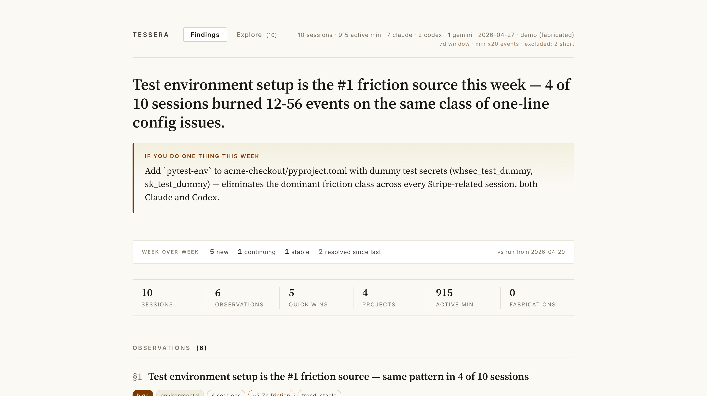

# tessera + tessera-live

Two complementary tools for understanding and improving how you use AI coding agents.

> 🔍 **[Live demo →](https://annasba07.github.io/tessera/)** (fictional data, click around in 5 seconds)



## What's in this repo

| Package | What it does |
|---|---|
| **[`tessera/`](tessera/)** | Weekly retrospective. Reads your local Claude Code, Codex, and Gemini CLI session traces, builds rich per-session narratives, then synthesizes cross-session patterns you can act on. Surfaced as an interactive HTML dashboard. |
| **[`tessera-live/`](tessera-live/)** | In-session real-time coach. Watches your live Claude Code session for known waste patterns and nudges Claude when one appears. Reads your `tessera` ratings to tune signal-to-noise. |

The two close a feedback loop: weekly reflection produces evidence-grounded findings → you rate them in the dashboard → those ratings shape what the coach surfaces in your next session.

## Quick start

```bash
# Install the CLI (also provides the coach hook binary)
pip install tessera-agents

# Run a weekly retrospective
tessera run

# Open the dashboard
open synthesis.html

# (Optional) install the in-session coach plugin
# In Claude Code:
/plugin add ./tessera-live
```

See each package's README for details.

## Repo layout

```
.
├── tessera/                # Python CLI + Claude Code slash command (/tessera)
│   ├── src/tessera/        # The package source (imported by the coach hook too)
│   ├── docs/
│   │   ├── ARCHITECTURE.md
│   │   └── schema/v1.md
│   ├── tests/
│   ├── README.md
│   └── ...
├── tessera-live/         # Claude Code plugin (separate /plugin install)
│   ├── .claude-plugin/plugin.json
│   ├── hooks/hooks.json
│   └── README.md
└── .github/workflows/
    └── test.yml                  # CI runs the tessera test suite
```

The coach plugin shells out to a CLI (`tessera-live-hook`) that ships inside the `tessera` Python package, so installing `tessera` is a prerequisite for the coach.

## Status

- `tessera` v0.4.0 — narrative + synthesis pipeline, interactive dashboard with inline rating, week-over-week timeline.
- `tessera-live` v0.4.0 — six mechanical waste-pattern rules, rating-driven nudge enrichment.

## License

MIT — see [tessera/LICENSE](tessera/LICENSE).
